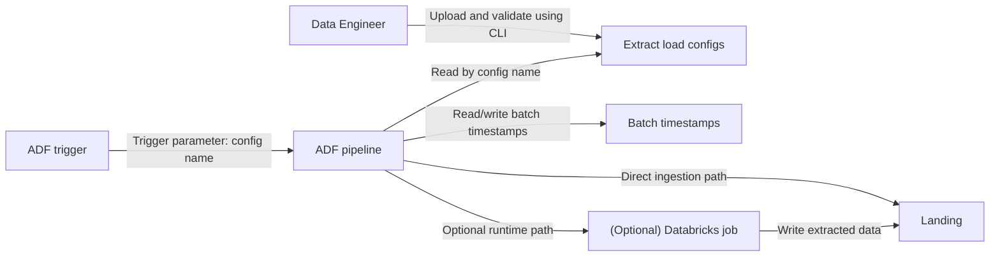
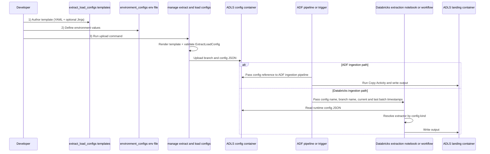

# Anine's ultimate ingestion framework

Reusable one-pipeline ingestion framework for Databricks and ADF, but the very same principles presented in this project can be achieved with other technologies as well.

The idea is:
- keep ingestion behavior config-driven (`extract_load_configs`)
- validate configs with shared models
- publish versioned runtime configs to storage
- run one notebook pipeline that picks extractor implementation by config kind

## Architecture

- `bundles/extract_load`
  - Databricks bundle service and runtime notebook (`src/parametrized/extraction.py`)
- `libs/extract-and-load`
  - typed config models (`ExtractLoadConfig`, extract kinds, load kinds)
  - extractor abstractions and implementations (for example `DummyApiExtractor`)
- `libs/manage-extract-and-load-configs`
  - CLI that renders Jinja templates, validates configs, and uploads JSON to ADLS
- `bundles/extract_load/fixtures/extract_load_configs`
  - source config templates per source/dataset
- `bundles/extract_load/fixtures/environment_configs`
  - environment-specific variables used during Jinja rendering
- `adf`
  - ADF pipelines/triggers orchestrate ingestion by passing config references and runtime parameters
  - execution can run in an ADF pipeline (for example Copy Activity) or in a Databricks notebook/workflow



## How The Framework Flows



1. Author a template in `extract_load_configs` (YAML with optional Jinja placeholders).
2. Define environment values in `environment_configs/<env>.yml`.
3. Upload via CLI:
   - template is rendered with env values
   - rendered config is validated by `extract-and-load` models
   - config is stored as JSON in ADLS using:
     - `<feature-branch-name>/<config-name>.json`
4. Run ADF orchestration:
   - ADF reads `extract_load_config_name`, `branch_name`, `current_batch_timestamp`, `last_batch_timestamp`
   - ADF routes execution to the configured runtime path:
     - run ingestion directly in ADF (for example Copy Activity), or
     - trigger Databricks notebook/workflow
   - selected runtime loads `ExtractLoadConfig` from ADLS as needed
   - selected runtime writes output using a partitioned path pattern:
     - `<source>/<dataset>/current_batch_timestamp=<timestamp>/filename.parquet`

This keeps one runtime pipeline while allowing many datasets/sources through config.

## Prerequisites

- `uv`
- Azure CLI (`az`)
- Databricks CLI (for bundle workflows)
- optional: `mise` for env switching helpers

## Local Setup

### 1) Sync environments

```bash
uv sync --directory libs/extract-and-load
uv sync --directory libs/manage-extract-and-load-configs
uv sync --directory bundles/extract_load
```

### 2) Install config CLI as a tool

```bash
uv tool install --editable "./libs/manage-extract-and-load-configs"
manage-extract-and-load-configs --help
```

### 3) Configure `.env`

Create `.env` in repo root:

```bash
EL_STORAGE_ACCOUNT_URL="https://<storage-account>.blob.core.windows.net"
EL_CONFIG_CONTAINER="extract-load-configs"
EL_LANDING_CONTAINER="landing"
EL_ENV="sandbox"
```

Notes:
- `EL_ENV` selects `environment_configs/<env>.yml` automatically.
- `EL_CONFIG_CONTAINER` is where validated runtime config JSON files are uploaded.
- `EL_LANDING_CONTAINER` is where extractors write parquet output.

### 4) Authenticate for storage access

```bash
az login
az account set --subscription "<subscription-id-or-name>"
```

`DefaultAzureCredential` is used by both config uploader and runtime storage clients.

## Working With `extract_load_configs`

Example upload:

```bash
manage-extract-and-load-configs upload \
  --source-path bundles/extract_load/fixtures/extract_load_configs
```

Example destroy:

```bash
manage-extract-and-load-configs destroy \
  --source-path bundles/extract_load/fixtures/extract_load_configs
```

Behavior:
- Upload always overwrites existing blobs.
- Jinja dotted keys are supported, for example:
  - `source_a.dataset_b.server: sandbox-sql.company.internal`

## Notebook Runtime (`bundles/extract_load`)

The notebook accepts widgets:
- `extract_load_config_name`
- `branch_name`
- `current_batch_timestamp` (`yyyy-MM-ddTHH:mm:ss.ffffffZ`)
- `last_batch_timestamp` (`yyyy-MM-ddTHH:mm:ss.ffffffZ`)

Then it:
- reads `ExtractLoadConfig` from ADLS (`<branch>/<config>.json`)
- resolves extractor by extract config kind
- executes extractor run

## Optional: `mise` Helpers

Use `mise.toml` tasks to switch active environment:

```bash
mise run env:show
mise run env:sandbox
mise run env:dev
mise run env:prod
```

Convenience:

```bash
mise run upload
mise run destroy
```
